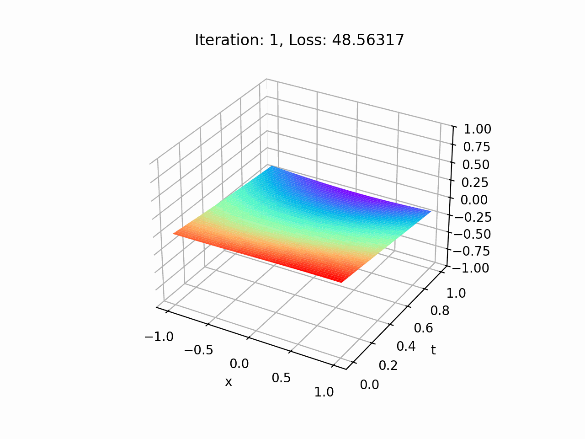

# About

This repository contains a Jupyter Notebook running Python to create a physics-informed neural network (PINN) as an alternative way to solve partial-differential equations (PDEs) of real physical systems.

# Summary 

I investigated solving the 1-D Heat/Diffusion equation with Dirichlet boundary conditions and the following initial conditions:

$$\begin{equation}
\frac{\partial{U}}{\partial{t}} = D\frac{\partial^{2}{U}}{\partial{x^{2}}},
\end{equation}
$$

$$ 
\begin{equation}
U(x = -L,t ) = U( x = -L,t )= 0,
\end{equation}
$$,

$$ 
\begin{equation}
U(x,t =0) = \sin(\pi x),
\end{equation}
$$
with $D=1$ and $L=1$ through a PINN. The PINN is structured in a similar way like traditional neural networks, however, we add a loss function that penalizes the PINN if the predicted values of the solution to the PDE or boundary conditions are incorrect.

# Relevant Python Packages

**Scientific Computing/Deep Learning**: NumPy, PyTorch

**Scientific Plotting**: Matplotlib, pillow, ImageIO
